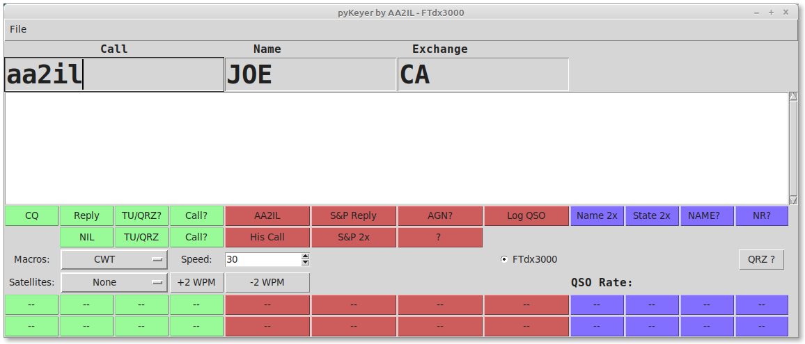
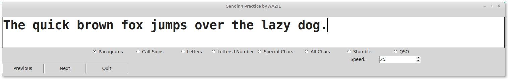

# PyKeyer

A CW contest keyer and logger in written Python.

Also can be used as a sending and receiving CW trainer.

# Background

Over the years, a number of very good logging programs have been developed.  The most popular of these today is the N1MM logger.  Unfortunately, this is a Windoz-only application and is very difficult to get working under linux.  My experience with the other options available for linux are either not being actively maintained and/or are too bloated and/or lacking to be useful for contesting.  Hence, the development of yet another keying/logging program.

Many thanks to Bill, N7DZ, and Lloyd, K7NX, for their efforts and help in testing these codes.

# Features

- Macros and data entry are focused on contest exchanges.
- Basic support for dx, ragchew and satellite contact is also provided.
- Large text used for data entry fields
- Rig can be interface via direct, flrig or hamlib connections
- Rig keying (via DTR) generated either internally or by NanoIO keyer (much more precise)
- Logging uses standard ADIF format
- Optional sidetone generation
- Practice mode for each supported contest 
- Variety of text generation facilities for practicing with keyer paddles.
- ...

# Installation under Linux using uv:

0) This seems to be the easiest/best solution.  uv is relatively new and is fast and easy compared to other solutions.  However, it does have a a problem running some tkinter gui apps with recent versions of python.  Of course, to use uv, you need to have it installed on your system:

      curl -LsSf https://astral.sh/uv/install.sh | sh      
      rehash     

1) Clone gitub pyKeyer, libs and data repositories

      cd
      mkdir Python
      cd Python
      git clone https://github.com/aa2il/pyKeyer
      git clone https://github.com/aa2il/libs
      git clone https://github.com/aa2il/data
      
2) One of the features of uv is that the virtual environment (a.k.a. container or sandbox) is included in the github repository.  You should NOT have to do anything since uv will install the environment and required packages the first time you run any of these codes.

For the record, here is how I set up the environment:

     cd ~/Python/pyKeyer
     uv init --python 3.12
     rm main.py
     uv add -r requirements.txt
   
     *** There is a problem with python 3.13 & tk under uv - use 3.12 until we figure this out ***
   
   https://github.com/astral-sh/python-build-standalone/issues/146
   
3) Make sure its executable and set PYTHON PATH so os can find libraries:

     cd ~/Python/pyKeyer
     chmod +x pyKeyer.py start start_cw

   - Under tcsh:      setenv PYTHONPATH $HOME/Python/libs
   - Under bash:      export PYTHONPATH="$HOME/Python/libs"
   
4) Bombs away:

     uv run pyKeyer.py
     uv run paddling.py
     uv run qrz.py

   or, 

     ./pyKeyer.py
     ./paddling.py
     ./qrz.py

# Installation for Windoz using uv:

0) This couldn't be much easier - and there's no need for a bulky installer!  You will need to install uv on your system by opening a cmd prompt and executing:

     powershell -ExecutionPolicy ByPass -c "irm https://astral.sh/uv/install.ps1 | iex"

You will also need a git client.  I use the command line version available from:

     https://git-scm.com/downloads/win
       
1) Open a cmd prompt and clone gitub wclock, libs and data repositories

     cd %userprofile%
     mkdir Python
     cd Python
     git clone https://github.com/aa2il/pyKeyer
     git clone https://github.com/aa2il/libs
     git clone https://github.com/aa2il/data

2) Run it - uv will magically rebuild the virtual environment the first time:

     cd wclock
     uv run wclock.py

# Other Installation Options

In the past, I have used other installation methods for both linux and windoz.  These are summarized in the companion file README2.md.

Additional note - to simply grab the latest changes, use "pull" instead of "clone" in the git commands:

      cd pyKeyer
      git pull https://github.com/aa2il/pyKeyer
      cd ../libs
      git pull https://github.com/aa2il/libs
      cd ../data
      git pull https://github.com/aa2il/data
     
